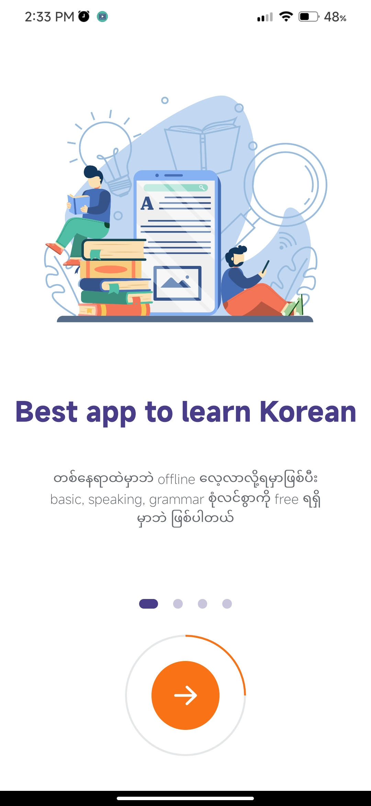
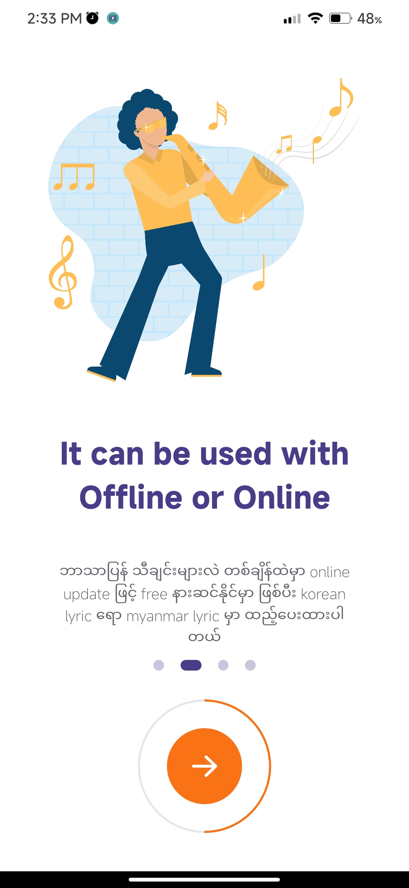
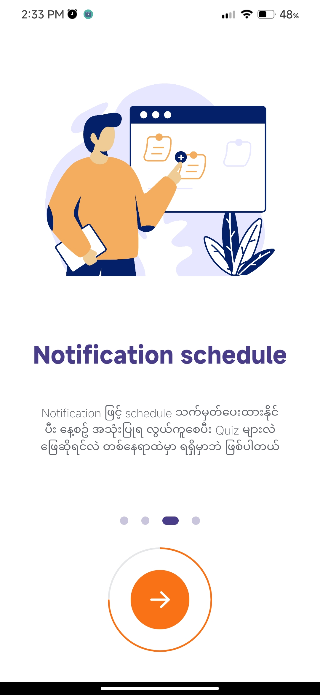
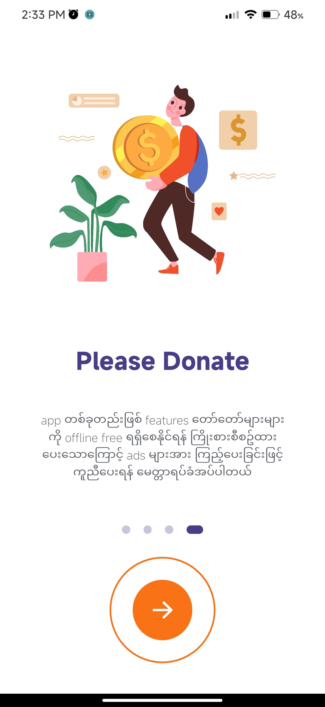
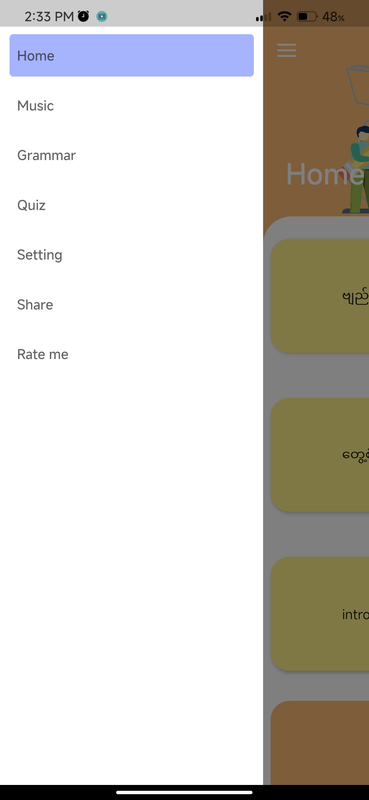
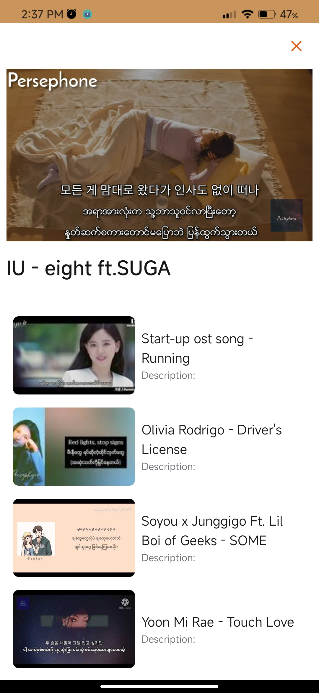

# Korea Handbook Mobile Application.

This is my mobile learning application project.
## Features
 - grammar are free.
 - speaking is also available.
 - korea-myanmar lyric music video.
 - mv can download.
 - also support dark theme.

## screenshots

